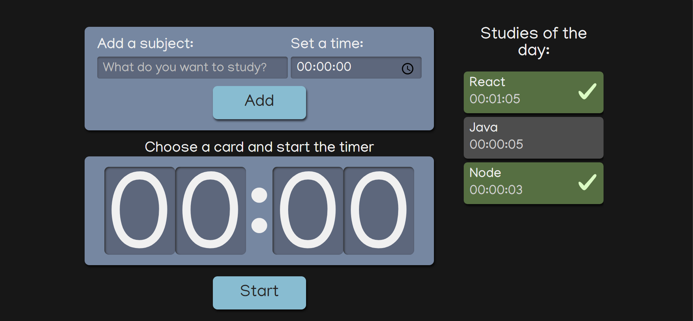

# Study-timer

A stopwatch where you can define the subject you want to study and set a time. When time's up, it becomes completed



## Step 1 - Dependencies

You will need:

* [Git](http://git-scm.com/downloads)
* [node](https://nodejs.org/) 

Please install them if you don't have them already.

## Step 2 - Clone the repository:

From the command line, clone the repository:

```sh
$ git clone https://github.com/mylenaverspeelt/study-timer.git
```

## Step 3 - Run the app

Once the dependencies are installed (npm install), you can run the app:

```sh
cd study-timer
npm start
```
Your browser should open up the running app, or you can access: http://localhost:3000/

Developed by: Mylena Verspeelt 🦜
 
